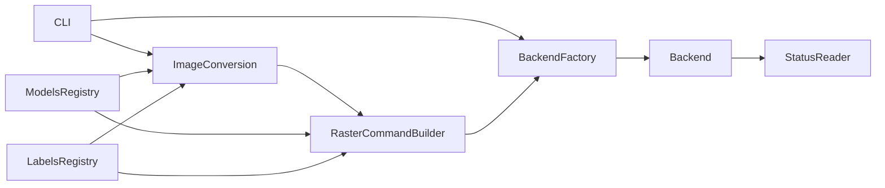

# Brother QL Node Port Architecture

## Objective
Rebuild `brother_ql` behavior in Node.js 24 with protocol-level parity and predictable cross-platform transport support.

## Upstream Module Inventory
- `cli.py`: user-facing command surface (`print`, `send`, `analyze`, `discover`, `info`).
- `conversion.py`: image preprocessing, label geometry rules, and pipeline to raster bytes.
- `raster.py`: low-level command stream builder and row encoding.
- `models.py`: printer capability registry.
- `labels.py`: label metadata registry and restrictions.
- `backends/*`: transport implementations and backend selection logic.
- `reader.py`: parser for instruction/status frames (useful for validation tooling).

## Proposed Node Package Boundaries
- `src/cli/*`: command parser and command handlers.
- `src/core/raster.ts`: `BrotherQlRaster` byte builder.
- `src/core/conversion.ts`: image-to-raster conversion pipeline.
- `src/data/models.ts` + `src/data/labels.ts`: generated static registries from upstream.
- `src/backends/*`: `network`, `usb`, optional `linuxKernel` backend.
- `src/protocol/reader.ts`: instruction/status decoder for diagnostics and tests.
- `src/errors.ts`: typed error taxonomy aligned with upstream semantics.

## High-Level Data Flow

## Design Constraints
- Preserve byte order and payload lengths exactly for all protocol opcodes.
- Keep transport layer isolated from conversion/raster logic.
- Treat model and label tables as source-of-truth data, not embedded logic.
- Make parity testable through golden fixtures generated by upstream Python.
