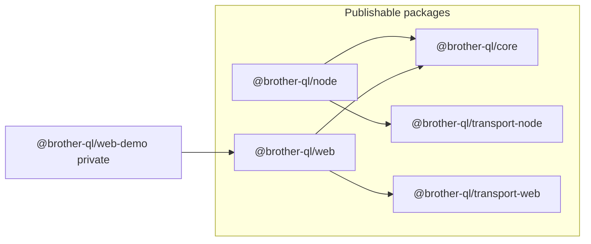
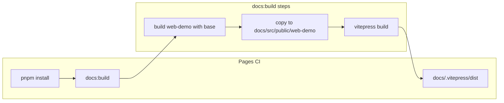

# `@brother-ql/web`, relocated demo, and GitHub Pages "Try it now"

Bundled plan combining the original **Add `@brother-ql/web` SDK** plan and the **Web SDK + Pages demo** extension. Single source of truth for implementation.

---

## Target shape

Mirror the existing Node SDK layout in [`packages/node`](../packages/node): `package.json`, `tsconfig.build.json`, `src/index.ts`, `src/index.test.ts`, `README.md`.

---

## Client API (`BrotherQlWebClient`)

**Follow [`BrotherQlNodeClient`](../packages/node/src/index.ts) where it fits:**

- **`generateBaselineCommand`** + **`sendBlocking`** from `@brother-ql/core` (same `print({ model, label, imageBytes, timeoutMs })` inputs as the Node client).
- **`transportFactory`** optional injection (same testing pattern as [`packages/node/src/index.test.ts`](../packages/node/src/index.test.ts)) using `WebUsbTransport` and `DirectSocketsTcpTransport` from `@brother-ql/transport-web`.

**Backend-specific behavior (document in README):**

| Backend                | Transports                                                                                   | Notes                                                                                                                                                                                                                                                                                                                                                                                                                                                                   |
| ---------------------- | -------------------------------------------------------------------------------------------- | ----------------------------------------------------------------------------------------------------------------------------------------------------------------------------------------------------------------------------------------------------------------------------------------------------------------------------------------------------------------------------------------------------------------------------------------------------------------------- |
| **Direct Sockets TCP** | [`DirectSocketsTcpTransport`](../packages/transport-web/src/direct-sockets-tcp-transport.ts) | Match Node: create transport in `print()`, rely on `sendBlocking` (which calls `connect()` internally — same as Node TCP path). Use `host` / `port` options like Node.                                                                                                                                                                                                                                                                                                  |
| **WebUSB**             | [`WebUsbTransport`](../packages/transport-web/src/webusb-transport.ts)                       | **Do not** copy Node’s “new USB transport every `print()`” blindly: browser `requestDevice()` and user-gesture rules make a **persistent** transport the right default. Recommended API: **`connect()`** (and **`dispose()`**) on `BrotherQlWebClient` when `backend === "webusb"`, holding one `WebUsbTransport`; **`print()`** requires an active connection (or clear error). Optional passthrough of `WebUsbTransportOptions` (`device`, `filters`) on `connect()`. |

Return values: align with Node where possible (`backend` discriminator, TCP includes `sendBlocking` result shape; WebUSB can mirror TCP’s result fields for consistency).

**Naming:** e.g. `backend: "webusb" | "tcp"` (with README note that `"tcp"` here means **Chrome Direct Sockets** `TCPSocket`, not Node `net.Socket`).

---

## Direct Sockets TCP: bleeding edge — still try it

- In **demo UI** and the **Try it now** doc page: keep the TCP (Direct Sockets) controls so curious users can attempt it.
- Copy should state clearly: **experimental / bleeding edge**, often **non-functional** on a normal `github.io` tab (permissions, origin trials, IWA, etc.), but **you can still try** — failures are expected and not necessarily a bug in the library.
- **WebUSB** remains the **recommended** path for the hosted demo (HTTPS on Pages + secure context).

---

## `transport-web` adjustments

- **Likely no code changes** if exports already cover the client (`WebUsbTransport`, `DirectSocketsTcpTransport`, and types from [`packages/transport-web/src/index.ts`](../packages/transport-web/src/index.ts)).
- **README updates:** position `@brother-ql/transport-web` as low-level `RuntimeTransport` implementations; point app authors to **`@brother-ql/web`** for the high-level client; update demo path / build instructions after the demo moves.

---

## Demo relocation

- Move `packages/transport-web/demo` to **`packages/web/demo`**.
- Rename package to e.g. **`@brother-ql/web-demo`**: depend on **`@brother-ql/web`** (drop direct `@brother-ql/core` if the app only uses the client).
- Refactor `demo/src/main.ts` to call **`BrotherQlWebClient`** instead of inlining `generateBaselineCommand` + `sendBlocking` + transports (same UI, thinner glue).
- Update `demo/index.html` title/copy to reference `@brother-ql/web`.
- [`pnpm-workspace.yaml`](../pnpm-workspace.yaml): replace `packages/transport-web/demo` with `packages/web/demo`.

---

## Ship the demo inside the VitePress build (GitHub Pages)

**Constraint:** VitePress emits the site to `docs/.vitepress/dist`; [`.github/workflows/pages.yml`](../.github/workflows/pages.yml) uploads that folder. The demo must end up **inside** that tree as static assets (no separate host).

**Recommended layout (avoid route clashes):**

- Build the Vite app with a **`base`** that matches VitePress [`base`](.vitepress/config.ts) **plus** a dedicated subpath, e.g. **`{vitepressBase}web-demo/`** → for production project Pages, e.g. **`/brother-ql-node/web-demo/`** (exact string should follow `resolveBase()` + chosen folder name).
- After `pnpm --filter @brother-ql/web-demo build`, copy **`packages/web/demo/dist`** → **`docs/src/public/web-demo/`** (VitePress copies `docs/src/public` verbatim into the site root when `srcDir` is `src`). Resulting URL: **`https://<user>.github.io/<repo>/web-demo/`**.

**`base` handling:**

- `demo/vite.config.ts` should add **`base`** from env (e.g. `DEMO_BASE` / `VITE_BASE`) so CI can set the full subpath; local `pnpm dev` can keep **`/`** or use **`/web-demo/`** for local parity with VitePress dev when needed.

**Orchestration:**

- Add a root script (e.g. **`build:web-demo-for-docs`**) that: (1) builds workspace packages as needed, (2) builds `@brother-ql/web-demo` with the correct **`base`**, (3) syncs **`dist`** → **`docs/src/public/web-demo/`** (clean copy).
- Change **`docs:build`** in root [`package.json`](../package.json) to run **`build:web-demo-for-docs`** before **`vitepress build docs`** so local and CI produce the same artifact.
- Update **`.github/workflows/pages.yml`**: ensure **`GITHUB_REPOSITORY`** is available if the demo build derives base from it (match VitePress), or pass **`DEMO_BASE`** explicitly from `github.repository` so asset URLs match the deployed site.

---

## "Try it now" page — not the main entry

- Add a **VitePress page** (e.g. `docs/src/guide/try-in-browser.md` or `docs/src/try/index.md`) that:
  - Explains **WebUSB** (Chrome, USB cable, secure context — satisfied on Pages).
  - Explains **Direct Sockets** as optional / likely broken in-browser — **try anyway** if you want.
  - Links to the live app: primary CTA **Open live demo** → **`/web-demo/`** (path relative to site base; resolves under project `base`).
- **Do not** replace the home hero primary story (Node-focused). Add a **secondary** discovery path only:
  - Optional third **hero action** on `docs/src/index.md` (e.g. "Try in browser", alt theme) → the new guide page, **or** only add to **nav/sidebar** in [`docs/.vitepress/config.ts`](.vitepress/config.ts).

---

## Repo wiring (tooling and docs)

- **New folder:** `packages/web/` with the same build/test conventions as `packages/node` (Vitest: root [`vitest.config.ts`](../vitest.config.ts) picks up `packages/**/*.test.ts`).
- **Coverage exclude:** change `vitest.config.ts` from `packages/transport-web/demo/**` to `packages/web/demo/**`.
- **ESLint:** extend the browser-capable override (`packages/transport-web/**/*.ts`) to **`packages/web/**/\*.ts`**; update **`ignores`** for demo `dist` if needed.
- **Docs / root README:** update references to demo commands ([`README.md`](../README.md), [`docs/development-workflow.md`](development-workflow.md), [`packages/transport-web/README.md`](../packages/transport-web/README.md)) to `pnpm --filter @brother-ql/web-demo dev` and document **`pnpm docs:build`** including the demo bundle.
- **New `packages/web/README.md`** modeled on the Node README (install, usage snippet, related packages).
- **Release script:** [`scripts/assert-release-version.mjs`](../scripts/assert-release-version.mjs) iterates `packages/*`; add **`packages/web/package.json`** with the same **version** as other publishable packages when cutting releases.
- **Gitignore:** prefer **`docs/src/public/web-demo/`** gitignored as a generated artifact so CI always builds it; or commit for simpler forks — team choice.

---

## Verification

- `pnpm install` (lockfile updates for new package).
- `pnpm build` and `pnpm test` from repo root.
- `pnpm --filter @brother-ql/web-demo dev` smoke-check.
- `pnpm docs:build` locally; open `docs/.vitepress/dist/web-demo/index.html` or `vitepress preview` and confirm assets load (no 404 on JS/CSS).
- `pnpm docs:dev`: spot-check `/web-demo/` after `build:web-demo-for-docs` (document workflow if needed).
